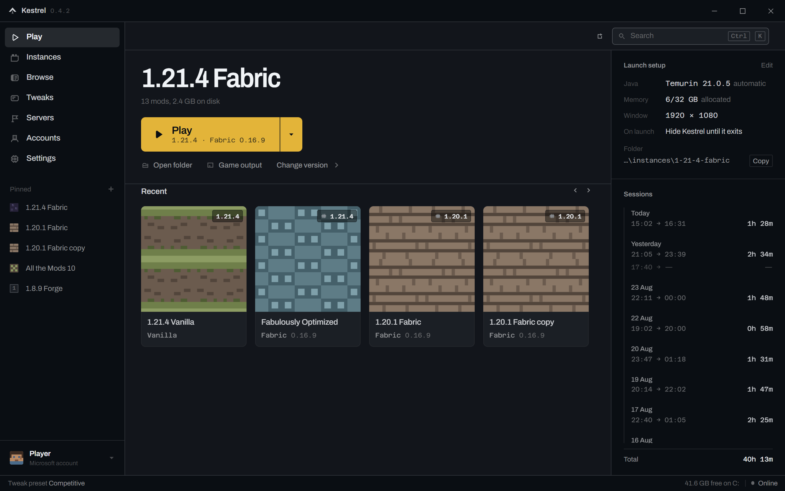
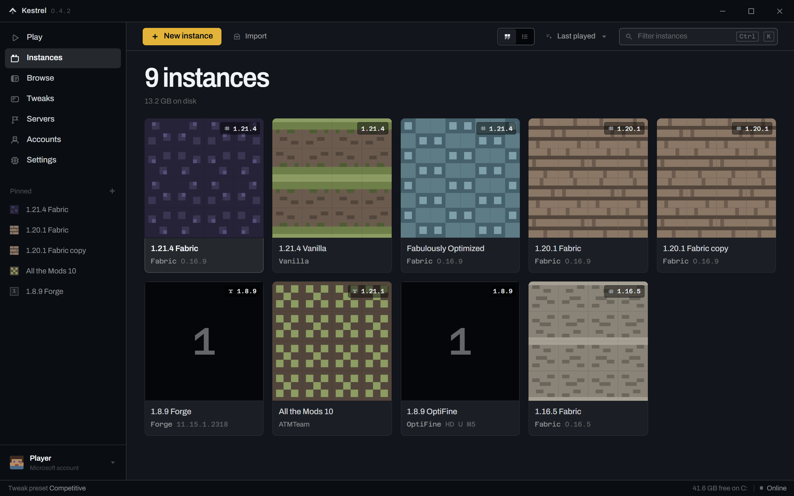
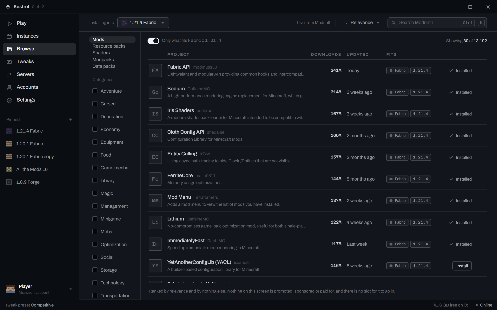

# Kestrel

A Minecraft launcher that does not sell you anything, does not watch what you do, and does not tell
servers what you are running.

> **Source-available, not open source.** You may read this code and run it to evaluate it.
> You may not redistribute it, modify it, build another product from it, or ship it under
> another name. It is published so its behaviour can be verified, not so it can be reused.
> See [`LICENSE`](LICENSE).

It downloads and launches Minecraft, installs mod loaders, and installs mods from Modrinth. Electron
shell, plain HTML/CSS/JS renderer, no framework, no build step.

    npm install
    npm start

Or build a Windows installer:

    npm run icon        build/icon.ico, drawn from the brand mark in the icon set
    npm run dist        dist/Kestrel-0.5.0-Setup.exe

It installs per-user, so it never asks for an administrator, and uninstalling leaves
`%APPDATA%\Kestrel` — your instances, mods and worlds — where it is. It is not code signed, so
SmartScreen will warn the first time. What goes into the build is an allow-list in
`electron-builder.yml`, and `npm run packcheck` reads the result back and proves it.

## Screenshots

*Play — the instance you were last in, what it will launch on, and the sessions behind it. Nothing
else competes for the button.*

*Instances — an instance is a Minecraft version, a loader and a folder of mods, so that is what its
name is. Two of these are the same setup twice, because that is what forking a working instance
leaves behind.*

*Browse — Modrinth, always scoped to the instance it is installing into. Ranked by relevance and by
nothing else: nothing here is promoted, sponsored or paid for.*

## Why

The launchers people actually use have picked up an ad slot, a store tab, promoted servers pinned
into your own server list, a subscription to remove the ads, and — in at least one case — a
server-facing API that lets a server ask which mods you have. Kestrel has none of that, and the
absence is the point.

## What it deliberately does not do

- **No ad slot.** There is nowhere for one to go.
- **No analytics, no telemetry, no crash reporting.** Nothing is sent anywhere you did not ask for.
- **No server-facing surface.** Kestrel never talks to a game server, so it has nothing to disclose.
  "We don't tell servers what you're running" is a property of the architecture, not a promise.
- **No allowlist on what you run.** Any jar in your mods folder loads. This is a launcher, not a
  gatekeeper. Wrong-loader jars are flagged with an explanation and a fix, never silently refused.
- **No account harvesting.** Sign-in uses Microsoft's device-code flow: you type your credentials on
  microsoft.com, never in this window. Tokens never enter the renderer process.

## Verify all of that yourself

Do not take any of it on trust:

    node tools/clicktest.mjs      every control on every screen, does it respond
    node tools/audit.mjs ui       the design standard
    node tools/phase3check.mjs    download + launch security assertions
    node tools/phase4check.mjs    loader merge rules
    node tools/phase5check.mjs    content install
    node tools/packcheck.mjs      what actually shipped in the packaged build
    bash  tools/scan.sh           Electronegativity + semgrep + npm audit + token containment

Stronger than any of those, and requiring no code reading at all: **run it with Wireshark open.**
It talks to Microsoft, Mojang, Modrinth and nothing else.

## Security

`contextIsolation`, `nodeIntegration: false`, `sandbox: true`. A CSP with no inline script and no
eval. All browser permissions denied. Downloads restricted to an exact-match host allow-list. Every
downloaded file SHA-verified, mismatch deletes and fails. Archive extraction is zip-slip guarded.
Path containment is proved, not assumed. Tokens live only in the main process, sealed at rest with
the OS keystore, and the launcher refuses to start rather than put one on a command line where any
other process could read it.

The renderer cannot name a file to download — installs take a plan id the main process minted after
you saw what it contained.

## Running Minecraft

Sign-in needs your own Azure application id. Copy `auth.config.example.json` to `auth.config.json`
and put yours in it, or set `KESTREL_MSA_CLIENT_ID`. Registering one is free — personal Microsoft
accounts only, public client flows on, no client secret — and Mojang must then approve it for the
Minecraft scopes at <https://aka.ms/mce-reviewappid>.

Without one, the launcher runs its sign-in screen against a local stub and says on screen that
nothing was really signed in. Everything else — instances, mods, loaders, launching offline — works.

## State

Working: vanilla launch, Fabric, legacy Forge, mod install with dependency resolution and hash
verification, enable/disable, resource packs and shader packs.

Packaged: `npm run dist` produces an unsigned NSIS installer. The packaged application has been
launched and confirmed to run out of its own asar, and `tools/packcheck.mjs` makes 47 assertions
about what came out — including that the developer's own Azure client id appears nowhere in either
the archive or the executable, searched byte by byte. The installer has not itself been put through
a clean install on a fresh machine.

Modern Forge and NeoForge work: the installer's processors are run, a JVM per processor, and the
patched client jar they build is what gets launched. NeoForge 1.21.1 has been installed and played
on this machine. `mc/processors.js` is honest at the top about what running somebody else's jars
costs, and about the one processor that reaches the network on its own.

Modrinth modpacks install: open a `.mrpack` and it becomes a new instance — the pack's own
Minecraft version, its loader, every file sha1-checked against the manifest, and its `overrides`
tree extracted with the same zip-slip guard everything else uses. The download urls in a pack are
written by its author, so they go through the same exact-match host allow-list as everything else.

Not finished: CurseForge `.zip` packs. See `RESUME.md`.

## Licence

**All rights reserved.** See `LICENSE`.

The source is published so anyone can verify what this launcher does and does not do — no ads, no
analytics, no telemetry, no server-facing surface. That is the whole reason it is readable.

It is *not* open source. You may read it and run it to evaluate it. You may not redistribute it,
modify it, build another product from it, or ship it under another name. If you want to do
something with it, ask.

